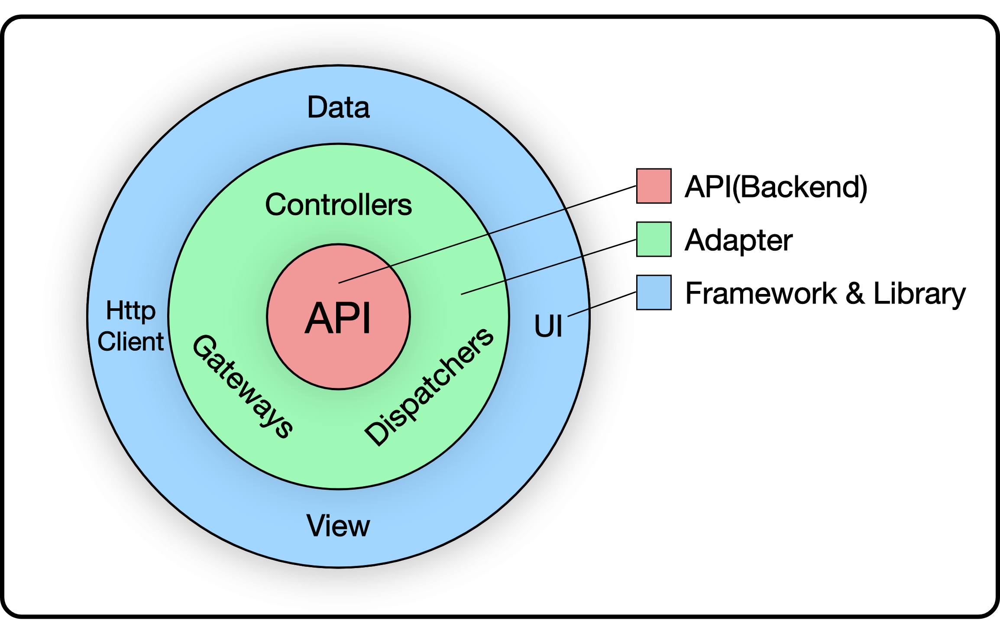
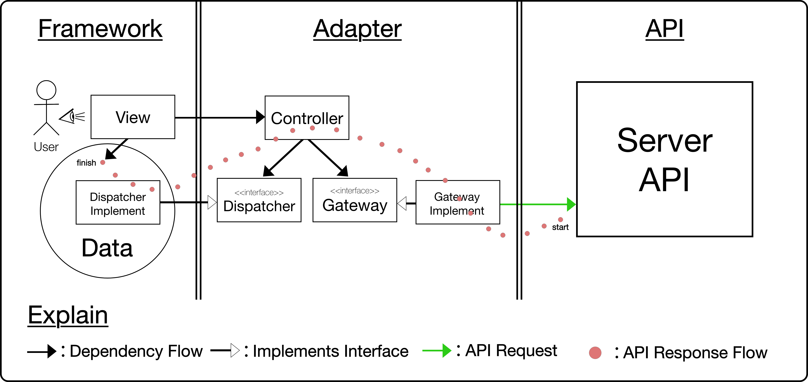
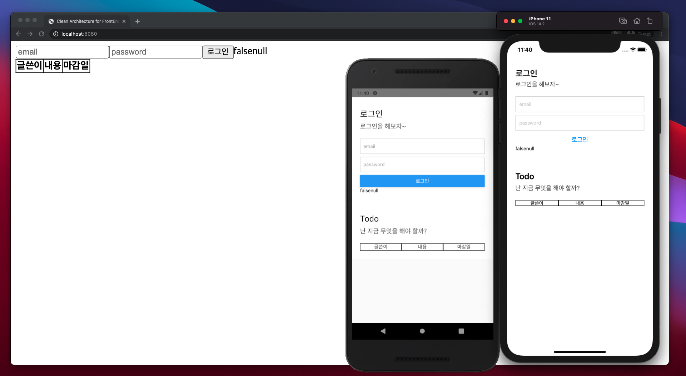
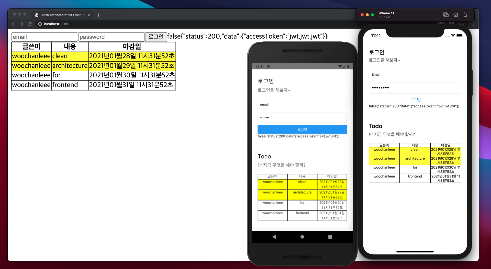

# Sample code of Frontend Clean Architecture

이 프로젝트는 프론트엔드를 공부 하는 학생(본인)이 클린 아키텍처를 적용하려고 노력하고 시도한 결과물 입니다.

앞으로 더 배워나갈 것이 많은 저에겐 Issue와 Pull Request는 너무 감사합니다.😊

부가 설명은 [개인 블로그](https://uchanlee.dev/clean-architecture/clean-architecture-for-frontend/)에 작성해 두었습니다.

## Skill

TypeScript, React.js, React Native, Redux, Mobx, axios, fetch

## Core rules



다음은 클린 아키텍처의 핵심 규칙입니다.

1. 소프트웨어를 계층별로 관심사를 분리합니다.
2. 의존성은 항상 저수준에서 고수준으로 향해야 합니다.
3. 데이터베이스나 프레임워크 UI 등 외부 요소에 의존하지 않습니다.

## System Flow



사용자가 시스템을 사용하는 과정을 위와 같이 다이어그램으로 표현하였습니다.

### Controller

검증이 필요하다면 Controller에서 합니다. View는 이러한 로직을 모른 채 보여주기만 하는것이 역할입니다.

1. Gateway, Dispatcher를 DI 받습니다.
2. Gateway를 이용하여 api request 후 response 받습니다.
3. 그 결과를 Dispatcher를 이용하여 `framework/~/data`에 저장합니다.

### Gateway

1. api request에 필요한 client를 DI 받습니다.
2. client는 `framework/~/http-client`에서 구현합니다.
3. client는 axios, fetch 등 다양한 라이브러리를 쉽게 교체할 수 있습니다.
4. client로 요청을 하고 응답을 받습니다.

### Dispatcher

- 저장소를 access할 수 있는 객체입니다.
- `framework/~/data`에서 구현됩니다.
- 라이브러리가 될수도 있고 디바이스 저장소가 될수도 있습니다.
- dispatcher는 Redux, Mobx 등 다양항 라이브러리를 쉽게 교체할 수 있습니다.

### Model

- `dto`는 api와 통신할때 전송, 전달되는 객체입니다.
  - `request`와 `response`로 이루어져있습니다.
- `vo`는 `View`에 보여질 수 있는 타입의 값으로 이루어진 객체입니다.
- 특정 값을 가지고 ui 스타일을 다르게 주기 위한 bool flag가 필요할때 사용하곤 합니다.
  - ex) Deadline을 지났을때 강조하기 위해 노란색을 칠하기 위한 flag 변수 `isLate`

### User

1. 로그인을 할 때 View에서는 단순히 email, password를 전달해 컨트롤러를 호출만 합니다. 어떠한 형태로 전달되야하는지 모릅니다.
2. UserController는 email, password가 유효한지 검증합니다.
3. UserController는 전달된 데이터를 `LoginRequest(DTO)` 형태로 재가공해 AuthGateway를 호출합니다.
4. UserController는 AuthGateway로부터 응답된 데이터를 `LoginResponse(DTO)` 옳바른 형태로 만들어 AuthDispatcher를 이용해 Data(Redux, Mobx 등)에 저장시킵니다.

### Todo

1. Todo를 불러올 때 View에서는 단순히 컨트롤러만 호출합니다.
2. TodoController는 TodoGateway를 이용해 api request합니다.
3. TodoController는 `GetTodosResponse(DTO)`를 TodoDispatcher를 이용해 Data(Redux, Mobx 등)에 저장시킵니다.
4. Deadline 값을 이용해 ui 강조 스타일을 주기 위한 플래그 변수인 `isLate`를 Data(Redux, Mobx 등)의 실제 저장되는 코드(reducer 등)에서 생성해줍니다.
5. reducer에서 Deadline이 지났는지 안지났는지 판단하는 로직을 이용해 `TodoVo(VO)`를 생성해 Data에 저장시켜줍니다.


## Directory Structure

```
/src
├─ adapter
│  ├─ controller
│  ├─ dispatcher
│  ├─ gateway
│  └─ model
│     ├─ dto
│     │  ├─ request
│     │  └─ response
│     └─ vo
└─ framework
   ├─ web
   │  └─ react
   │     ├─ config
   │     ├─ data
   │     │  ├─ indexed-DB
   │     │  ├─ local-storage
   │     │  ├─ session-storage
   │     │  ├─ mobx
   │     │  └─ redux
   │     ├─ http-client
   │     ├─ main
   │     ├─ util
   │     │  ├─ function
   │     │  └─ interface
   │     └─ view
   │        ├─ component
   │        ├─ container
   │        ├─ page
   │        └─ route
   └─ mobile
      └─ ReactNative
         ├─ android
         ├─ ios
         ├─ data
         │  ├─ async-storage
         │  └─ redux
         │     ├─ module
         │     └─ store
         ├─ http-client
         ├─ main
         ├─ util
         │  ├─ function
         │  └─ interface
         └─ view
            ├─ component
            ├─ container
            └─ screen
```

- framework의 폴더 구조는 프레임워크마다 달라질수 있습니다.

## main directory

'클린 아키텍처 26장 메인(Main) 컴포넌트'에 따라서 main 폴더에서 모든 의존성 주입을 하는 지저분한 컴포넌트 입니다. 시스템의 초기 진입점이기도 합니다.

## Service Images




## Available Scripts

### 1. Mock Server

#### Install

```shell
# $ cd /mock-server
$ npm install
```

#### Start

```shell
# $ cd /mock-server
$ npm start
```

### 2. Web

#### Install

```shell
# $ cd /src/framework/web/react
$ npm install
```

#### Start

```shell
# $ cd /src/framework/web/react
$ npm start
```

### 3. Mobile(android, iOS)

#### Install

```shell
# $ cd /src/framework/mobile/ReactNative
$ npm install
# $ cd /src/framework/mobile/ios
$ pod install
```

#### Start

```shell
# $ cd /src/framework/mobile/ReactNative
$ npm start
$ npm run android
$ npm run ios
```

## Solving Problems

[로컬 서버 api를 이용하는데 Android에서 Request Failed 뜰때 해결법](https://19park.tistory.com/240)
